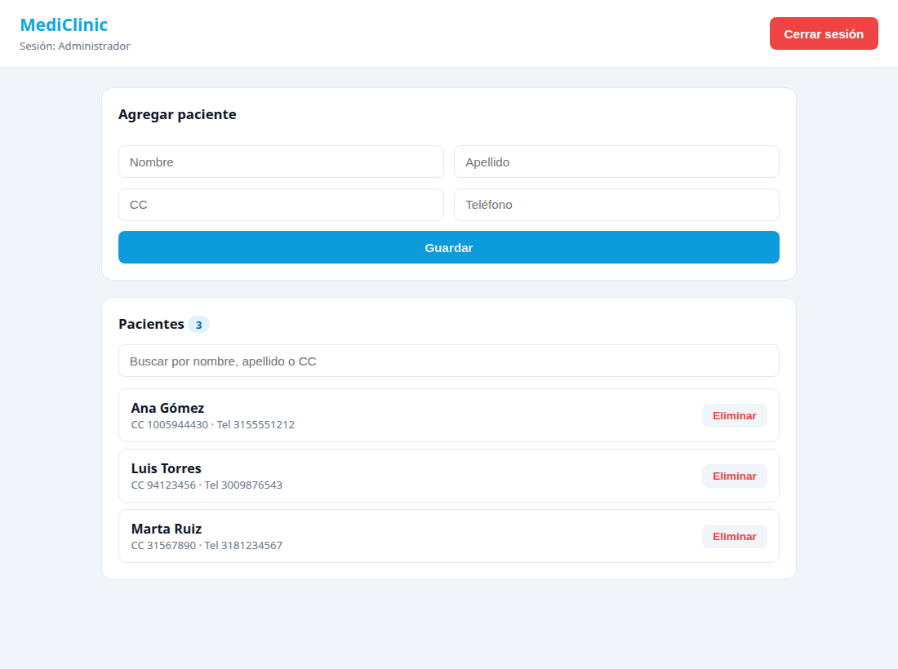
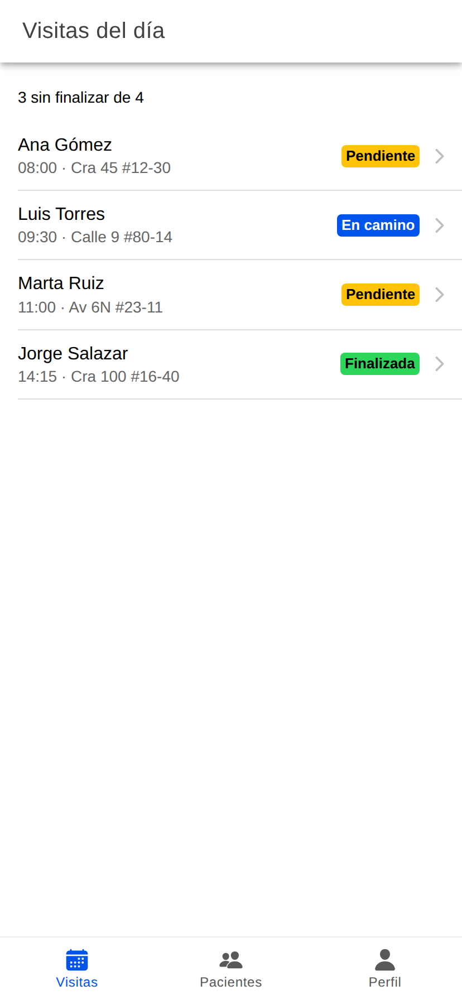

# Parcial 1 - Desarrollo de Software para Plataformas Móviles

César Armando Reyes Oliveros - 2236379
Ingeniería de Datos e IA, UAO - 2026-2S

Las dos aplicaciones del parcial para el caso de MediClinic. Cada una está en su
carpeta y funciona por separado:

- `pwa-react/` - ejercicio 1, la PWA de administración de pacientes.
- `ionic-react/` - ejercicio 2, la app de visitas del médico en Ionic.
- `capturas/` - pantallazos de las dos corriendo.

No hay backend en ninguna de las dos, todo se guarda en localStorage, y los
pacientes de una app no se ven en la otra (usan claves distintas).

## Ejercicio 1 - PWA en React

Login con usuarios quemados en `src/data/usuarios.ts` (`admin@mediclinic.com` /
`123`). Si entra bien guarda la sesión en localStorage, y como el `useState` de
`App` arranca leyendo esa clave, al recargar la página sigue adentro. El botón de
cerrar sesión borra la clave. Si las credenciales están mal aparece el mensaje de
error debajo del formulario.

Ya adentro está el CRUD de pacientes: formulario con nombre, apellido, CC y
teléfono, la lista con el contador y el botón de eliminar. Las validaciones son
sobre nombre y apellido (mínimo 2 letras y sin números) y sobre la CC (entre 6 y
12 dígitos, y que no esté repetida). La lista se persiste con un `useEffect` que
se dispara cada vez que cambia el arreglo.

El buscador filtra por nombre, apellido o CC. Tanto la lista completa como el
texto de búsqueda viven en `Pacientes.tsx`, que es el padre, y a
`ListaPacientes.tsx` le llega por props solamente el arreglo ya filtrado, que era
lo que pedía el punto.

Para la parte de PWA seguí los pasos de la clase 2: el `manifest.json` en
`public/` con los iconos y `display: standalone`, enlazado desde el `index.html`;
el `service-worker.js` con estrategia Network First (intenta la red y si no hay
responde del caché); y el registro en `main.tsx`. Sobre HTTPS queda pendiente el
despliegue, en local lo probé con `vite preview` en localhost, que el navegador
trata como origen seguro.

```bash
cd pwa-react
npm install
npm run dev
# para ver el service worker activo toca la build:
npm run build && npx vite preview
```

## Ejercicio 2 - App en Ionic React

El login está hecho con `IonInput` / `IonButton` dentro de un `IonList`, y cuando
las credenciales fallan sale un `IonToast` rojo arriba. La sesión también queda en
localStorage (`medico@mediclinic.com` / `123`).

Después del login la navegación es con `IonTabs`: Visitas, Pacientes y Perfil.

En Visitas salen las del día ordenadas por hora, con el paciente, la hora y un
badge de color según el estado. Al tocar una se abre `/visitas/:id` y el detalle
lee el id con `useParams`. Desde ahí se avanza el estado en el orden que pide el
enunciado: pendiente, en camino y finalizada. Le dejé además un botón para
reabrirla, porque si uno se equivoca de visita no había forma de devolverse.

La sesión, las visitas y los pacientes están en un context (`context/Clinica.tsx`)
para no pasar props por toda la app; ese context es el único que escribe en
localStorage.

```bash
cd ionic-react
npm install --legacy-peer-deps
npm run dev
```

El `--legacy-peer-deps` toca sí o sí: npm no resuelve los peers de las
dependencias de test que trae la plantilla de Ionic y el install se cae.

## Capturas

En `capturas/` están los pantallazos de los dos ejercicios: login con error,
validaciones, lista de pacientes, búsqueda, los tabs, el detalle de la visita con
los tres estados y la sesión después de recargar.




