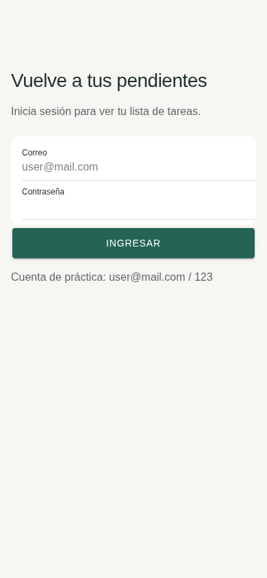

# Challenge 04 - Storage Ionic

## Enunciado (Clase 04 - Routing and Storage)

Create a new Demo Login Page in ionic. It should contain:

- Email
- Password
- Button to Login

When the button is clicked, we are going to validate if the user is:

- user: `user@mail.com`
- password: `123`

In that case, we are going to store a token called `logged = true` and redirect to the
List page. Next time we enter to the app, we're going to check if the user is logged,
then is not necessary to log-in again.

Create a button to logout, then when the button is clicked, the app will clean the token
and redirects to login page.

## Checklist

- [x] Pagina de login con email, password y boton
- [x] Validacion contra user@mail.com / 123
- [x] Guardar token `logged = true` en storage
- [x] Redireccion a la pagina List tras login correcto
- [x] Al abrir la app, si hay token no pedir login de nuevo
- [x] Boton de logout que limpia el token y vuelve al login

## Notas

En la planilla del curso figura como "Storage Ionic".

## Cómo correrlo

Necesitas Node 22.12 o superior.

```bash
npm ci
npm run dev
```

Para revisar la versión que se publica:

```bash
npm run build
npm run preview
```

## Recorrido

La cuenta del ejercicio es **user@mail.com / 123**. Si los datos no coinciden,
se muestra el aviso en el formulario. Si son correctos, se guarda `logged = true`
en localStorage y se abre `/list`.

La lista permite agregar, completar y eliminar tareas. Al volver a abrir la app,
se consulta el token antes de decidir qué pantalla mostrar. `/list` también
revisa la sesión: escribir esa dirección sin haber entrado lleva a `/login`.
Cerrar sesión elimina solo el token; las tareas siguen guardadas.

Es un login de práctica con la cuenta que pide el enunciado, sin servidor de
autenticación.

## Pruebas

```bash
npx playwright install chromium
npm run build
npm test
```

Las pruebas abren la compilación en una ventana de tamaño móvil y revisan los
recorridos principales, incluida la persistencia al recargar. No se ha probado
la instalación en un teléfono físico.

## Capturas



