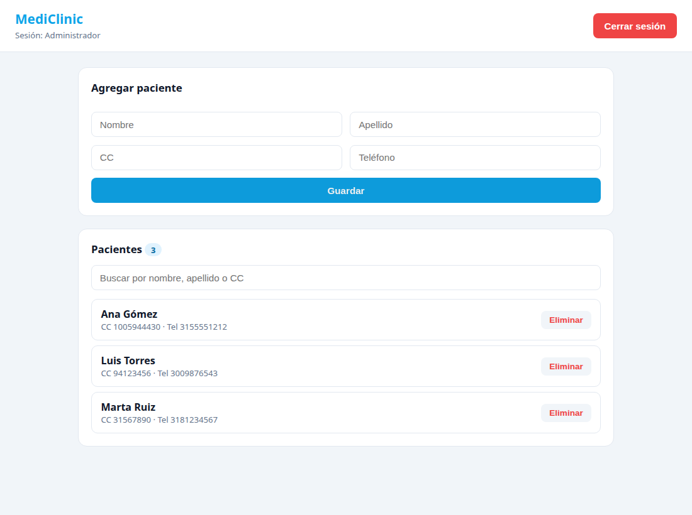
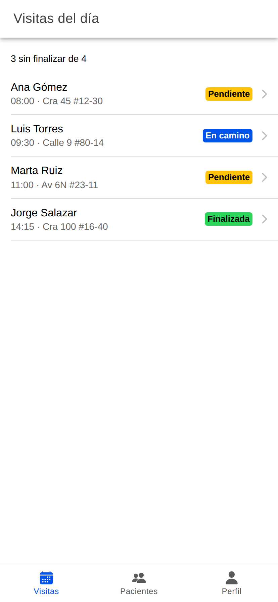
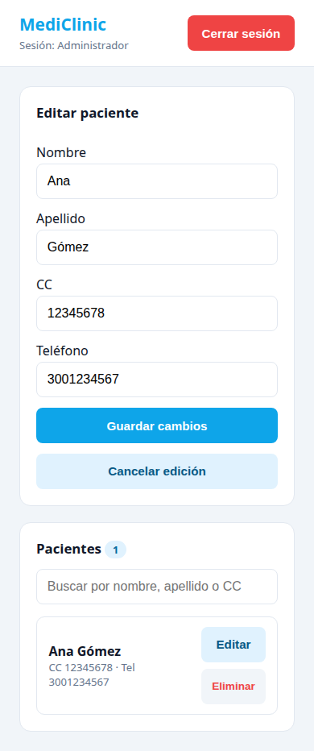

# Parcial 1 - Desarrollo de Software para Plataformas Móviles

César Armando Reyes Oliveros - 2236379
Ingeniería de Datos e IA, UAO - 2026-2S

Las dos aplicaciones del parcial para el caso de MediClinic. Cada una está en su
carpeta y funciona por separado:

- `pwa-react/` - ejercicio 1, la PWA de administración de pacientes.
- `ionic-react/` - ejercicio 2, la app de visitas del médico en Ionic.
- `capturas/` - pantallazos de las dos corriendo.

No hay backend en ninguna de las dos, todo se guarda en localStorage, y los
pacientes de una app no se ven en la otra (usan claves distintas).

## Ejercicio 1 - PWA en React

Login con usuarios quemados en `src/data/usuarios.ts` (`admin@mediclinic.com` /
`123`). Si entra bien guarda la sesión en localStorage, y como el `useState` de
`App` arranca leyendo esa clave, al recargar la página sigue adentro. El botón de
cerrar sesión borra la clave. Si las credenciales están mal aparece el mensaje de
error debajo del formulario.

Ya adentro está el CRUD de pacientes: formulario con nombre, apellido, CC y
teléfono, la lista con el contador y los botones de editar y eliminar. Al editar se puede
guardar o cancelar; la CC puede conservarse, pero no duplicar la de otro paciente. Las validaciones son
sobre nombre y apellido (mínimo 2 letras y sin números) y sobre la CC (entre 6 y
12 dígitos, y que no esté repetida). La lista se persiste con un `useEffect` que
se dispara cada vez que cambia el arreglo.

El buscador filtra por nombre, apellido o CC. Tanto la lista completa como el
texto de búsqueda viven en `Pacientes.tsx`, que es el padre, y a
`ListaPacientes.tsx` le llega por props solamente el arreglo ya filtrado, que era
lo que pedía el punto.

Para la parte de PWA seguí los pasos de la clase 2: el `manifest.json` en
`public/` con los iconos y `display: standalone`, enlazado desde el `index.html`;
el `service-worker.js` que genera el build a partir de `scripts/service-worker.js`
(primero la red para el HTML y primero la caché para los archivos); y el registro en `main.tsx`. Sobre HTTPS queda pendiente el
despliegue, en local lo probé con `vite preview` en localhost, que el navegador
trata como origen seguro.

```bash
cd pwa-react
npm ci
npm run dev
# para ver el service worker activo toca la build:
npm run build && npx vite preview
```

## Ejercicio 2 - App en Ionic React

El login está hecho con `IonInput` / `IonButton` dentro de un `IonList`, y cuando
las credenciales fallan sale un `IonToast` rojo arriba. La sesión también queda en
localStorage (`medico@mediclinic.com` / `123`).

Después del login la navegación es con `IonTabs`: Visitas, Pacientes y Perfil.

En Visitas salen las del día ordenadas por hora, con el paciente, la hora y un
badge de color según el estado. Al tocar una se abre `/visitas/:id` y el detalle
lee el id con `useParams`. Desde ahí se avanza el estado en el orden que pide el
enunciado: pendiente, en camino y finalizada. Le dejé además un botón para
reabrirla, porque si uno se equivoca de visita no había forma de devolverse.

La sesión, las visitas y los pacientes están en un context (`context/Clinica.tsx`)
para no pasar props por toda la app; ese context es el único que escribe en
localStorage.

```bash
cd ionic-react
npm ci
npm run dev
```

Las dependencias de pruebas están actualizadas y la instalación normal con
`npm ci` funciona. Se necesita Node 22.12 o superior.

## Pruebas

En cualquiera de las dos carpetas:

```bash
npm ci
npx playwright install chromium
npm run build
npm run lint
npm test
```

En `ionic-react` también se ejecuta `npm run test.unit`. Las pruebas revisan la
sesión y los cambios de estado de las visitas. Las de navegador recorren login,
navegación, pacientes y cierre de sesión. En la PWA se cubren altas, edición,
validaciones, búsqueda, borrado y apertura offline después de la primera visita.

El build de la PWA guarda todos los recursos que necesita para funcionar sin
conexión. El service worker solo se registra en producción para no interferir
con el desarrollo local.

## Capturas

En `capturas/` están los pantallazos de los dos ejercicios: login con error,
validaciones, lista de pacientes, búsqueda, los tabs, el detalle de la visita con
los tres estados y la sesión después de recargar.






