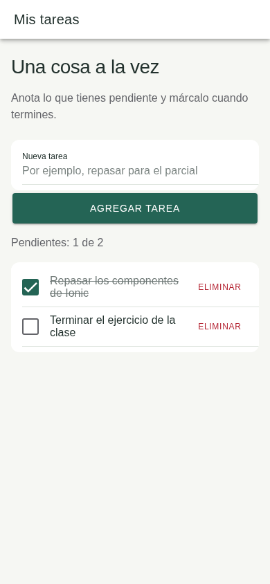

# Challenge 03 - Tasks Ionic

## Enunciado (Clase 03 - Ionic)

Create a new Task Manager app in ionic.

It should contain:

- States and effects, if it's necessary
- Child and parent components - at least 3 components
- View a task list
- Add new tasks
- Mark tasks as completed
- Delete tasks

## Practica previa de la misma clase (Practice 01)

Once the environment is installed, let's practice into ionic. Based on the React app from
Challenge 01: it's not necessary to uninstall your PWA. Let's migrate your app to ionic
using only ionic components. Verify that the app continues working, installing it in your phone.

## Checklist

- [x] App nueva en Ionic (no es la de contactos)
- [x] Uso de estados y efectos donde aplique
- [x] Minimo 3 componentes entre padres e hijos
- [x] Ver lista de tareas
- [x] Agregar tareas
- [x] Marcar tareas como completadas
- [x] Eliminar tareas

## Notas

En la planilla del curso figura como "Tasks Ionic".

## Cómo correrlo

Necesitas Node 22.12 o superior.

```bash
npm ci
npm run dev
```

Para revisar la versión que se publica:

```bash
npm run build
npm run preview
```

## Cómo está organizado

`Tareas.jsx` mantiene la lista y la guarda con un efecto. `TareaForm` recibe lo
que se escribe, `ListaTareas` recorre el arreglo y `TareaItem` tiene la casilla y
el botón de eliminar. Los cambios vuelven al padre por funciones que recibe cada
componente.

Se puede marcar una tarea como terminada y desmarcarla si hace falta. Las tareas
quedan en localStorage, así que recargar la página no borra la lista. Un título
vacío muestra un aviso y no agrega nada.

## Pruebas

```bash
npx playwright install chromium
npm run build
npm test
```

Las pruebas abren la compilación en una ventana de tamaño móvil y revisan los
recorridos principales, incluida la persistencia al recargar. No se ha probado
la instalación en un teléfono físico.

## Capturas


